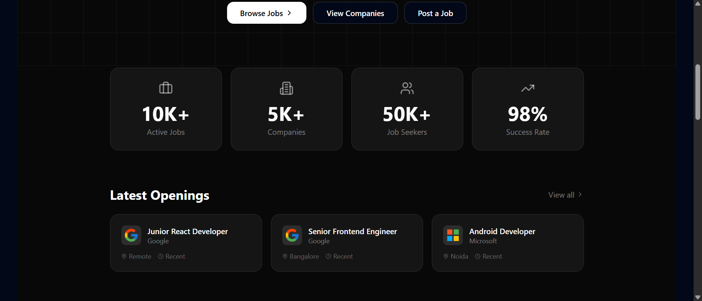
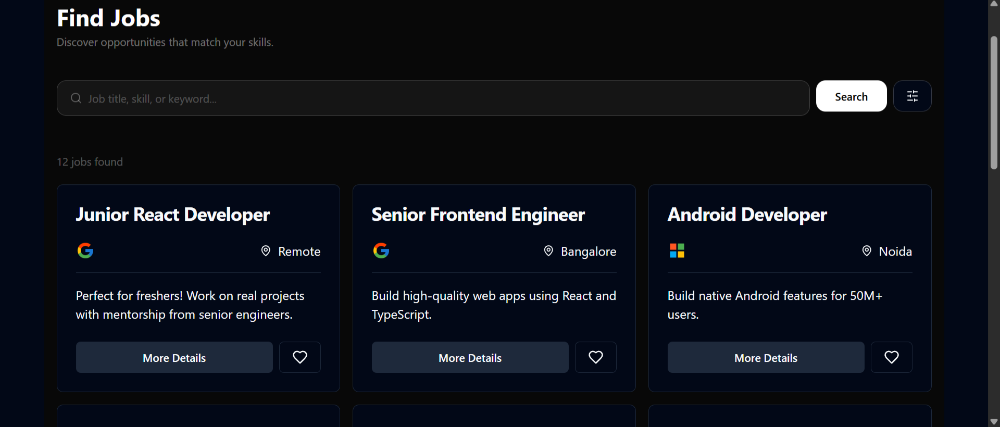
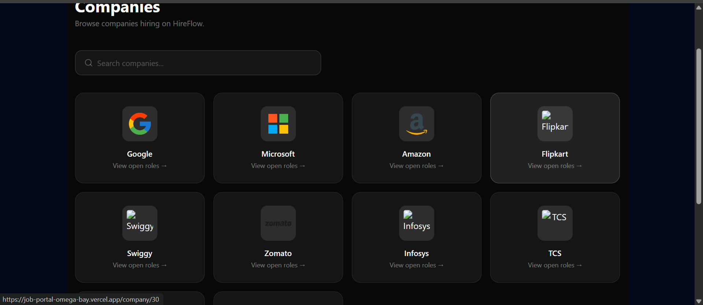
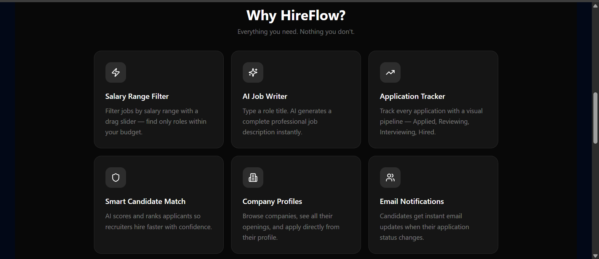
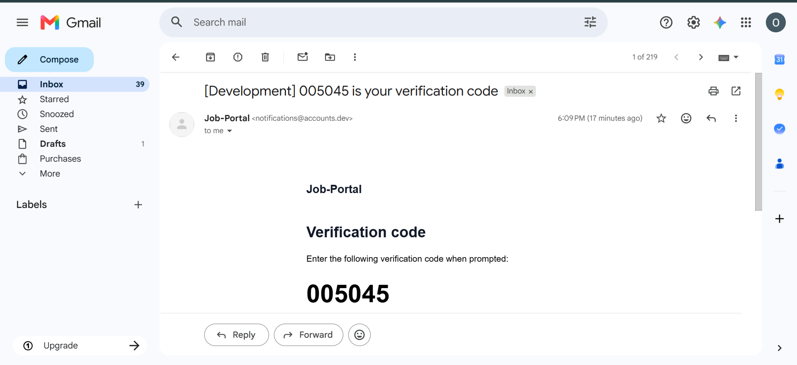

# HireFlow — Job Portal

A full-stack job portal where candidates can browse and apply to jobs, and recruiters can post roles, review applicants, and let AI handle the busywork — from writing job descriptions to ranking candidates.

**Live:** [job-portal-omega-bay.vercel.app](https://job-portal-omega-bay.vercel.app/)

---

## 📋 Table of Contents

- [Overview](#overview)
- [Tech Stack](#tech-stack)
- [Features](#features)
- [Screenshots](#screenshots)
- [Getting Started](#getting-started)
- [Environment Variables](#environment-variables)
- [Database Setup](#database-setup)
- [Deployment](#deployment)

---

## Overview

HireFlow is a two-sided job portal built on React and Supabase. Job seekers can search roles by keyword, location, and salary range, track every application through a visual pipeline, and browse companies before applying. Recruiters get a faster path to a finished listing with an AI job-description generator and an AI candidate-ranking tool that scores applicants against the role's requirements.

Authentication and role management (candidate vs. recruiter) are handled by Clerk, with all application data — jobs, companies, and applications — stored in Supabase Postgres and secured with row-level security policies.

---

## Tech Stack

| Layer | Technology |
|---|---|
| Framework | React 18 (Vite) |
| Auth | Clerk |
| Database | Supabase (Postgres) |
| File Storage | Supabase Storage |
| AI | Anthropic Claude API |
| Styling | Tailwind CSS + Shadcn UI |
| Routing | React Router |
| Hosting | Vercel |

---

## Features

### Landing Page
- Hero search bar with live job count
- Stats strip — active jobs, companies, job seekers, success rate
- Latest openings preview pulled directly from the database
- Feature grid and "how it works" section for both candidates and recruiters

### Auth & Roles (Clerk)
- Email and Google sign-in
- Role selection on onboarding — candidate or recruiter
- Recruiter-only UI elements (Post a Job, AI Job Writer) gated by role

### Jobs
- Full job listing grid with company logo, title, and location
- Search by title or keyword
- Filter by location and company
- **Salary range slider** — drag to filter jobs by annual salary band
- Individual job detail page with full description and requirements

### Companies
- Directory of all companies hiring on the platform
- Search companies by name
- Company profile page showing every open role at that company

### Applications
- Candidates apply directly from a job listing with resume upload
- **Application Tracker** — a visual pipeline (Applied → Reviewing → Interviewing → Hired/Rejected) for every job a candidate has applied to
- Recruiters view and update applicant status per job

### AI Job Writer (recruiters)
- Recruiter enters a role title, required skills, and experience level
- Claude generates a complete, structured job description in seconds
- Generated text can be copied or sent straight into the Post a Job form

### Smart Candidate Match (recruiters)
- AI reads every applicant's listed skills and experience against the job's requirements
- Returns a match score and a short reasoning summary per candidate
- Ranks applicants so recruiters can prioritise the strongest fits first

---

## Screenshots

| Page | Description |
|---|---|
| **Landing Page** | Hero section with "Find Your Dream Job and get HireFlow'd" headline and live search bar |
| **Sign In Modal** | Clerk-powered authentication with Google OAuth and email sign-in |
| **Job Listings** | Grid of open roles with company, location, and a "More Details" / save action on each card |
| **Companies Directory** | All companies hiring on the platform, each linking to their open roles |
| **Features** | Overview of platform features for candidates and recruiters |
| **Email Notifications** | Status update emails sent to candidates |

#### Landing Page


#### Sign In Modal


#### Job Listings


#### Companies Directory


#### Features


#### Email Notifications


---

## Getting Started

### Prerequisites
- Node.js 18+
- A Supabase project
- A Clerk application

### Installation

```bash
git clone https://github.com/Pragati-coders/Job-Portal.git
cd Job-Portal
npm install
```

### Run the development server

```bash
npm run dev
```

Open [http://localhost:5173](http://localhost:5173).

---

## Environment Variables

Create a `.env` file in the root:

```env
# Supabase
VITE_SUPABASE_URL=
VITE_SUPABASE_ANON_KEY=

# Clerk
VITE_CLERK_PUBLISHABLE_KEY=
```

A `.env.example` is included in the repo as a template.

---

## Database Setup

The Supabase project uses four core tables:

- **companies** — `id`, `name`, `logo_url`
- **jobs** — `id`, `title`, `description`, `location`, `company_id` (FK), `recruiter_id`, `requirements`, `salary_min`, `salary_max`
- **applications** — `id`, `job_id` (FK), `candidate_id`, `status`, `resume`, `skills`, `experience`, `education`, `candidate_name`
- **saved_jobs** — `id`, `user_id`, `job_id` (FK)

Row Level Security is enabled on all four tables, with public read access on `companies` and `jobs`, and authenticated access on `applications` and `saved_jobs`.

Supabase Storage buckets:
- `resumes` — candidate resume uploads
- `company-logo` — uploaded company logos

---

## Deployment

The project is deployed on **Vercel**:

1. Push the repo to GitHub
2. Import the repo at [vercel.com](https://vercel.com)
3. Add the three environment variables under **Project → Settings → Environment Variables**
4. Deploy

**Live URL:** [https://job-portal-omega-bay.vercel.app](https://job-portal-omega-bay.vercel.app/)

---

## 🌟 Show your support

Give a ⭐ if this project helped you!